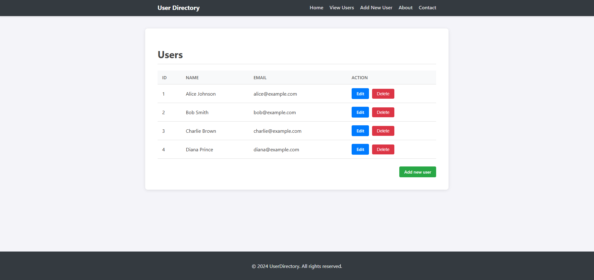
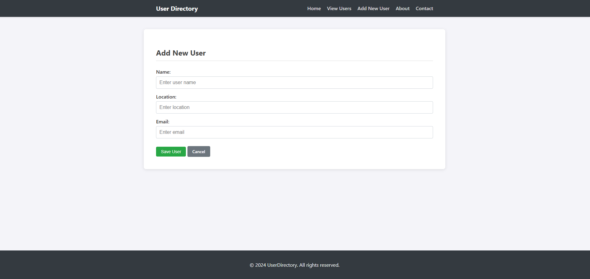

# UserDirectory — Example Web Application

## Table of Contents
- [Introduction](#introduction)
- [Features](#features)
- [Technologies Used](#technologies-used)
- [Usage](#usage)
- [References](#references)
- [Contributing](#contributing)

## Introduction
A lightweight Spring Boot and Thymeleaf-based web application for managing user data. This project demonstrates a clean, server-side rendered architecture using pure CSS and no external frontend frameworks.

## Features
* **Core Stack:** Spring Boot Web, Spring Data JPA, and Thymeleaf.
* **Database:** H2 (In-memory) with Flyway for version control and migrations.
* **Styling:** Custom, responsive CSS (No Bootstrap).
* **Testing:** JUnit 5 and MockMvc integration tests.

## Technologies Used
- **Languages**: Java 17+, HTML5, CSS3
- **Framework**: Spring Boot 3.x
- **Database**: H2 Database Engine
- **Tools**: Maven, Flyway

## Usage
#### Prerequisites
Ensure all Maven modules are installed and the project is fully indexed before executing.
* **Java Version**: Use JDK 17 or later.

#### Running the App
To execute the **UserDirectory** application, run the main class `Application.java`.

**Source Path**: `src/main/java/com/example/Application.java`

Once started, the application will automatically attempt to open your default browser to:
`http://localhost:8080`

## Screenshots
### UserDirectory Users Page

### UserDirectory View Users Page

## Contributing
This is an example project. For contributing or using the software, please contact the owner to request changes.

## References
* [Maven Repository](https://mvnrepository.com/)
* [Spring Boot](https://spring.io/projects/spring-boot)
* [Thymeleaf](https://www.thymeleaf.org/)
* [H2 Database](https://www.h2database.com/)
* [Flyway](https://flywaydb.org/)